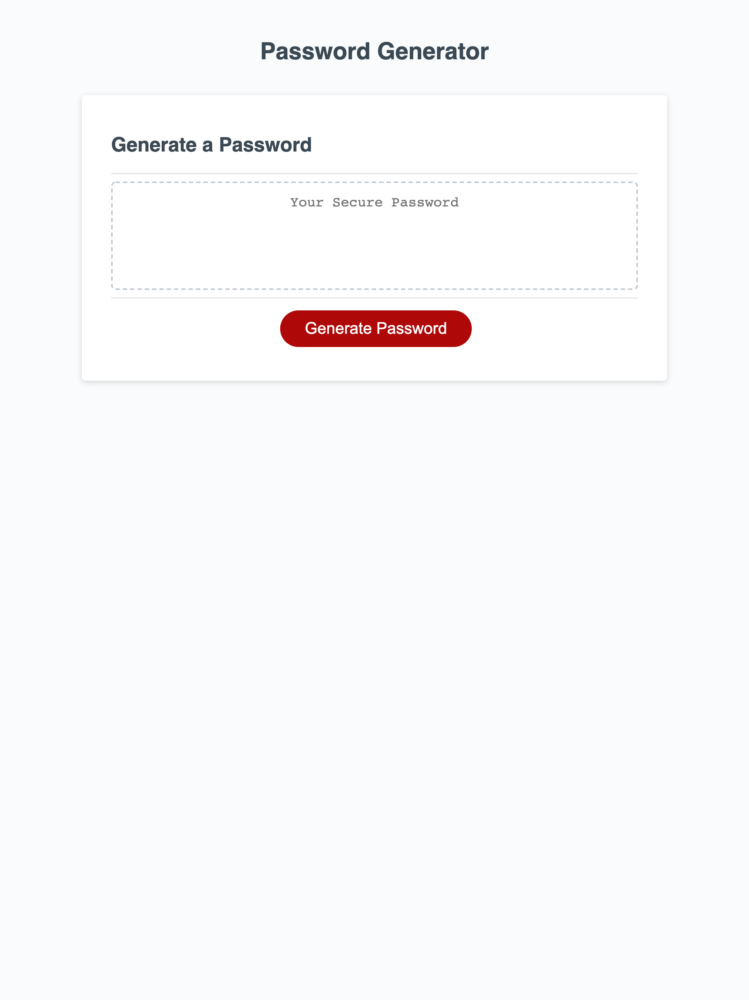

# Password Generator (friendly-parakeet)

This application was created to generate a random and secure password for the user. Allowing the user to include or exclude certain types of characters, the password is personalized to the user. 

Lorem epson

** Technologies **
1. HTML
The HTML was already fully functioning, I did not edit or update in this version.

2. CSS
The CSS was already fully functioning, I did not edit or update in this version.

3. JavaScript
I implemented the Javascript for allowing the user to choose criteria for and generate their randomized password.

** Contributions **
This application was created by Lacey Griffith with HTML and CSS provided by The Coding Bootcamp.

** Results **
This application is complete in terms of being functional and having a basic design. The final application can be found by clicking [here](https://lacey-griffith.github.io/friendly-parakeet/)
